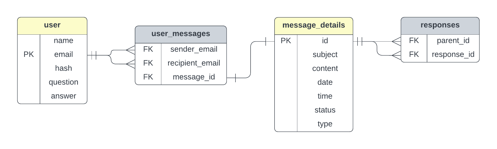

<a id="readme-top"></a>


<!-- PROJECT LOGO -->
<br />
<div align="center">
  <a href="https://github.com/othneildrew/Best-README-Template">
    
  </a>

  <h3 align="center">BeeMaile</h3>

  <p align="center" stylee="font-size: large;
    font-family: 'Times New Roman', Times, serif;
    font-weight: lighter;
    font-style: italic;
    text-decoration-line: underline;">
    Speeding up your communication and uniting your team, BeeMail
    <br />
    <a href="https://github.com/othneildrew/Best-README-Template"><strong>Explore the docs »</strong></a>
    <br />
    <br />
    <a href="https://github.com/othneildrew/Best-README-Template">View Demo</a>
    ·
    <a href="https://github.com/othneildrew/Best-README-Template/issues/new?labels=bug&template=bug-report---.md">Report Bug</a>
    ·
    <a href="https://github.com/othneildrew/Best-README-Template/issues/new?labels=enhancement&template=feature-request---.md">Request Feature</a>
  </p>
</div>


## Demo Link
#### Quick Demo:  <URL [HERE](https://youtu.be/HhA8Dpr6IvQ)>
#### In-Depth Demo:  <URL [HERE](https://youtu.be/k5HBm5l-yJ8?si=QjAO20z61ZZukZP7)>

---

<!-- TABLE OF CONTENTS -->
<details>
  <summary>Table of Contents</summary>
  <ol>
    <li><a href="#overview">Overview</a></li>
    <li><a href="#key-features">Key Features</a></li>
    <li><a href="#database-design">Database Design</a></li>
    <li><a href="#challenges-and-solutions">Challenges and Solutions</a></li>
    <li>
      <a href="#getting-started">Getting Started</a>
      <ul>
        <li><a href="#prerequisites">Prerequisites</a></li>
        <li><a href="#installation">Installation</a></li>
        <li><a href="#installation-tutorial-video">Installation</a></li>
      </ul>
    </li>
    <li><a href="#usage">Usage</a></li>
    <li><a href="#built-with">Built With</a></li>
    <li><a href="#contact-information">Contact Information</a></li>
    <li><a href="#acknowledgments">Acknowledgments</a></li>
  </ol>
</details>

---

## Overview
This project was developed as the final project for the CS50x course. It is a web-based application that allows users to send and receive emails. Built with Flask, HTML, CSS, Jinja templates, and a SQL database, the application integrates both front-end and back-end technologies to provide a seamless user experience.

### Goal
The primary goal of this project was to apply the web development concepts and database skills I learned in CS50x by creating an integrated web application.

<p align="right">(<a href="#readme-top">back to top</a>)</p>

---

## Key Features
- **User Registration**: Validates email structure and checks for duplicates before hashing passwords for secure storage.
- **Login System**: Ensures authentication by validating credentials against hashed passwords.
- **Password Reset**: Allows users to reset their password securely using a verification question.
- **Main Page**: Provides users with quick access to new emails and responses, streamlining communication.
- **Inbox**: Displays received emails, marking them as read or unread based on user actions.
- **Sent Items**: Allows users to review sent emails and their responses.
- **Compose Email**: Enables users to send emails with subject, content, and recipient validation.
- **Email Replies**: Supports replies linked to parent emails using a dedicated "responses" table.
- **Profile Management**: Lets users view and update their profile information.
- **Error Handling**: Catches database conflicts during simultaneous email submissions and prompts users to retry.

  <p align="right">(<a href="#readme-top">back to top</a>)</p>

---

## Database Design
 <!-- Add a link or embed the image here -->

### Schema Reference
> <a href="./Database/database_scheme.sql">Database Schema</a>

### Explanation
- **Users Table**: Stores user details like name, email, hashed password, and verification question/answer.
- **Message Details Table**: Tracks email content, date, time,  reply/primary type, and read/unread status.
- **User Messages Table**: Links users to their sent and received emails.
- **Responses Table**: Maps replies to their parent emails.

  <p align="right">(<a href="#readme-top">back to top</a>)</p>

---

## Challenges and Solutions
- **Simultaneous Email Submissions**: Solved using a unique database index combining content, subject, date, and time, along with `try-except` error handling.
- **Password Security**: Implemented hashing to ensure passwords are never stored in plaintext.
- **Data Integrity**: Used relational tables to maintain consistency between emails and responses.

  <p align="right">(<a href="#readme-top">back to top</a>)</p>

---

## Getting Started

### Prerequisites
- Python 3.10 or higher
- Flask
- SQLite3

### Installation
1. Clone the repository:
   ```bash
   git clone https://github.com/b-4her/BeeMail.git
2. Navigate to the project directory:
    ```bash  
   cd BeeMail
3. Install dependencies:
   ```bash
   pip install -r requirements.txt
4. Run the application:
   ```bash
   python app.py

<p align="right">(<a href="#readme-top">back to top</a>)</p>

### Installation Tutorial Video
https://github.com/user-attachments/assets/c1b57928-aa4c-4e0c-8d67-67175f7eb412

<p align="right">(<a href="#readme-top">back to top</a>)</p>

### Usage

1. Open the application in your browser by navigating to the link provided in your terminal after running Flask.
2. Navigate through the following sections:
   - Registration: Create a new account.
   - Login: Log in with your credentials.
   - Inbox: View your received emails.
   - Compose: Send a new email.
   - Profile: Update your personal details.
3. Please refer to the Project Photos folder for a visual overview.
   >  <a href="./assets/project photos/pages.pdf">Project Photos</a>
   
For more information on how to use the website, please refer to [In-Depth Demo](https://youtu.be/k5HBm5l-yJ8?si=QjAO20z61ZZukZP7) video.

<p align="right">(<a href="#readme-top">back to top</a>)</p>

---

### Built With
* [![Bootstrap][Bootstrap.com]][Bootstrap-url]

- Python: Backend logic.
- Flask: Web framework.
- SQLite3: Database management.
- HTML/CSS/Bootstrap: Frontend design.
- Jinja2: Template rendering.
- Werkzeug: Security utilities for password hashing.

  <p align="right">(<a href="#readme-top">back to top</a>)</p>

### Contact Information
For any questions or feedback, reach out via:
- LinkedIn: [b-4her](https://www.linkedin.com/in/b-4her)
- GitHub: [b-4her](https://github.com/b-4her)
- YouTube: [b-4her](https://www.youtube.com/@b-4her)
- Email: b4her1info@gmail.com

### Acknowledgments
Special thanks to the CS50 team for inspiration.
Flask Documentation: For excellent resources.
Stack Overflow: For troubleshooting help.

<p align="right">(<a href="#readme-top">back to top</a>)</p>


<!-- MARKDOWN LINKS & IMAGES -->
[Bootstrap.com]: https://img.shields.io/badge/Bootstrap-563D7C?style=for-the-badge&logo=bootstrap&logoColor=white
